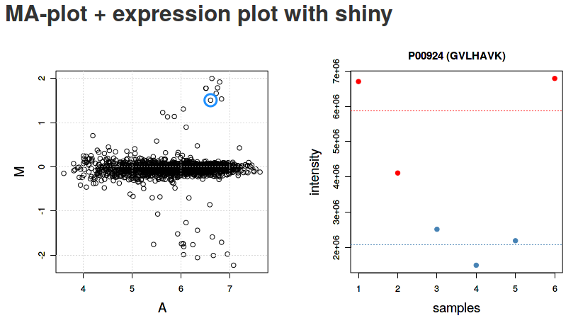

<!--
%\VignetteEngine{knitr::rmarkdown}
%\VignetteIndexEntry{Visualisation of proteomics data using R and Bioconductor}
%\VignetteKeyword{bioinformatics, proteomics, mass spectrometry, visualisation}
%\VignettePackage{RforProteomics}
-->

```{r style, echo = FALSE, results = 'asis', message=FALSE}
BiocStyle::markdown()
```


**Package:** `r Biocexptpkg("RforProteomics")`<br />
**Authors:** Authors: [Laurent Gatto](http://cpu.sysbiol.cam.ac.uk/lgatto/),
[Lisa Breckels](http://cpu.sysbiol.cam.ac.uk/) and
[Sebastian Gibb](http://sebastiangibb.de/research.html)
<br />
**Last compiled:** `r date()`<br />
**Last modified:** `r file.info("RProtVis.Rmd")$mtime`


```{r env, message=FALSE, echo=FALSE}
library("RforProteomics")
library("BiocInstaller")
library("mzR")
library("MSnbase")
library("knitr")
library("rpx")
library("xtable")
library("RColorBrewer")
library("MALDIquant")
library("MALDIquantForeign")
library("pRoloc")
library("pRolocdata")
library("msmsTests")
library("msmsEDA")
```

## Introduction

### References

- CRAN Task View: Graphic Displays & Dynamic Graphics & Graphic
  Devices & Visualization:
  http://cran.r-project.org/web/views/Graphics.html
- CRAN Task View: Web Technologies and Services:
  http://cran.r-project.org/web/views/WebTechnologies.html
- ggplot2
  [book](http://link.springer.com/book/10.1007%2F978-0-387-98141-3)
  (syntax is slightly outdated) ([code](http://ggplot2.org/book/)),
  [web page](http://ggplot2.org/) and
  [on-line docs](http://docs.ggplot2.org/current/)
- lattice
  [book](http://lmdvr.r-forge.r-project.org/figures/figures.html) and
  [web page](http://lattice.r-forge.r-project.org/)
- *R Graphics* [book](https://www.stat.auckland.ac.nz/~paul/RG2e/)
- [R Cookbook](http://www.cookbook-r.com/Graphs/) and
  [R Graphics Cookbook](http://shop.oreilly.com/product/0636920023135.do)

### Relevant packages

```{r packs, cache=TRUE, warning=FALSE, echo=FALSE}
library("RforProteomics")
pp <- proteomicsPackages()
msp <- massSpectrometryPackages()
```

There are currently `r nrow(pp)`
[Proteomics](http://bioconductor.org/packages/devel/BiocViews.html#___Proteomics)
and `r nrow(msp)`
[MassSpectrometry](http://bioconductor.org/packages/devel/BiocViews.html#___MassSpectrometry)
packages in Bioconductor version `r as.character(biocVersion())`.
Other non-Bioconductor packages are described in the `r Biocexptpkg("RforProteomics")`
[vignette](http://bioconductor.org/packages/devel/data/experiment/vignettes/RforProteomics/inst/doc/RforProteomics.pdf).

```{r pptab, echo=FALSE, results='asis'}
kable(pp, format = "html")
```

```{r msptab, echo=FALSE, results='asis'}
kable(msp, format = "html")
```

## Ascombe's quartet

```{r anscombe, echo = FALSE, results='asis'}
kable(anscombe, format = "html")
```

```{r anscombetab}

tab <- matrix(NA, 5, 4)
colnames(tab) <- 1:4
rownames(tab) <- c("var(x)", "mean(x)",
                   "var(y)", "mean(y)",
                   "cor(x,y)")

for (i in 1:4)
    tab[, i] <- c(var(anscombe[, i]),
                  mean(anscombe[, i]),
                  var(anscombe[, i+4]),
                  mean(anscombe[, i+4]),
                  cor(anscombe[, i], anscombe[, i+4]))

```

```{r anstabdisplay, echo=FALSE}
kable(tab)
```

While the residuals of the linear regression clearly indicate
fundamental differences in these data, the most simple and
straightforward approach is visualisation to highlight the fundamental
differences in the datasets.

```{r anscombefig, dev='png'}
ff <- y ~ x

mods <- setNames(as.list(1:4), paste0("lm", 1:4))

par(mfrow = c(2, 2), mar = c(4, 4, 1, 1))
for (i in 1:4) {
    ff[2:3] <- lapply(paste0(c("y","x"), i), as.name)
    plot(ff, data = anscombe, pch = 19, xlim = c(3, 19), ylim = c(3, 13))
    mods[[i]] <- lm(ff, data = anscombe)
    abline(mods[[i]])
}
```

<!-- ```{r anscombe, ref.label='anscombefig', echo=FALSE, dev='pdf'} -->
<!-- ``` -->

```{r anscomberesids, echo=FALSE, fig.cap="The 11 sets of residuals for Anscombe's four datasets."}
kable(sapply(mods, residuals))
```

## The MA plot example

The following code chunk connects to the `PXD000001` data set on the
ProteomeXchange repository and fetches the `mzTab` file. After missing
values filtering, we extract relevant data (log2 fold-changes and
log10 mean expression intensities) into `data.frames`.

```{r, makemadata, warning=FALSE, cache=TRUE}
library("rpx")
px1 <- PXDataset("PXD000001")
mztab <- pxget(px1, "PXD000001_mztab.txt")

library("MSnbase")
qnt <- readMzTabData(mztab, what = "PEP")
sampleNames(qnt) <- reporterNames(TMT6)
qnt <- filterNA(qnt)
## may be combineFeatuers

spikes <- c("P02769", "P00924", "P62894", "P00489")
protclasses <- as.character(fData(qnt)$accession)
protclasses[!protclasses %in% spikes] <- "Background"


madata42 <- data.frame(A = rowMeans(log(exprs(qnt[, c(4, 2)]), 10)),
                       M = log(exprs(qnt)[, 4], 2) - log(exprs(qnt)[, 2], 2),
                       data = rep("4vs2", nrow(qnt)),
                       protein = fData(qnt)$accession,
                       class = protclasses)

madata62 <- data.frame(A = rowMeans(log(exprs(qnt[, c(6, 2)]), 10)),
                       M = log(exprs(qnt)[, 6], 2) - log(exprs(qnt)[, 2], 2),
                       data = rep("6vs2", nrow(qnt)),
                       protein = fData(qnt)$accession,
                       class = protclasses)


madata <- rbind(madata42, madata62)
```

### The traditional plotting system

```{r, mafig1}
par(mfrow = c(1, 2))
plot(M ~ A, data = madata42, main = "4vs2",
     xlab = "A", ylab = "M", col = madata62$class)
plot(M ~ A, data = madata62, main = "6vs2",
     xlab = "A", ylab = "M", col = madata62$class)

```

<!-- ```{r mafig1pdf, ref.label='mafig1', echo=FALSE, dev='pdf', fig.width=9, fig.height=6} -->
<!-- ``` -->

### lattice

```{r mafig2}
library("lattice")
latma <- xyplot(M ~ A | data, data = madata,
                groups = madata$class,
                auto.key = TRUE)
print(latma)

```

<!-- ```{r mafig2pdf, ref.label='mafig2', echo=FALSE, dev='pdf', fig.width=8, fig.height=6} -->
<!-- ``` -->

### ggplot2

```{r mafig3}

library("ggplot2")
ggma <- ggplot(aes(x = A, y = M, colour = class), data = madata,
               colour = class) +
                   geom_point() +
                       facet_grid(. ~ data)
print(ggma)

```

<!-- ```{r mafig3pdf, ref.label='mafig3', echo=FALSE, dev='pdf', fig.width=8, fig.height=6} -->
<!-- ``` -->

### Customization

```{r macols}

library("RColorBrewer")
bcols <- brewer.pal(4, "Set1")
cls <- c("Background" = "#12121230",
         "P02769" = bcols[1],
         "P00924" = bcols[2],
         "P62894" = bcols[3],
         "P00489" = bcols[4])

```


```{r macust}

ggma2 <- ggplot(aes(x = A, y = M, colour = class),
                data = madata) + geom_point(shape = 19) +
                    facet_grid(. ~ data) + scale_colour_manual(values = cls) +
                        guides(colour = guide_legend(override.aes = list(alpha = 1)))
print(ggma2)

```

<!-- ```{r macustpdf, ref.label='macust', echo=FALSE, dev='pdf', fig.width=8, fig.height=6} -->
<!-- ``` -->

### The `MAplot` method for `MSnSet` instances

```{r mafigmsnset}
MAplot(qnt, cex = .8)
```

### An interactive `r CRANpkg("shiny")` app for MA plots

This app is based on Mike Love's
[shinyMA](https://github.com/mikelove/shinyMA) application, adapted
for a proteomics data. A screen shot is displayed below. To start the
application:

```{r shinyMA, eval=FALSE}
shinyMA()
```



The application is also available online at
[https://lgatto.shinyapps.io/shinyMA/](https://lgatto.shinyapps.io/shinyMA/).

See the excellent `r CRANpkg("shiny")`
[web page](http://shiny.rstudio.com/) for tutorials. 

### Volcano plots

Below, using the `r Biocpkg("msmsTest")` package, we load a example
`MSnSet` data with spectral couting data (from the `r
Biocpkg("msmsEDA")` package) and run a statistical test to obtain
(adjusted) p-values and fold-changes.

```{r msmsTestsData, cache=TRUE}
library("msmsEDA")
library("msmsTests")
data(msms.dataset)
## Pre-process expression matrix
e <- pp.msms.data(msms.dataset)
## Models and normalizing condition
null.f <- "y~batch"
alt.f <- "y~treat+batch"
div <- apply(exprs(e),2,sum)
## Test
res <- msms.glm.qlll(e,alt.f,null.f,div=div)
lst <- test.results(res,e,pData(e)$treat,"U600","U200",div,
                    alpha=0.05,minSpC=2,minLFC=log2(1.8),
                    method="BH")
```

Here, we produce the volcano plot by hand, with the `plot`
function. In the second plot, we limit the x axis limits and add grid
lines.

```{r volc1}
plot(lst$tres$LogFC, -log10(lst$tres$p.value))
plot(lst$tres$LogFC, -log10(lst$tres$p.value),
     xlim = c(-3, 3))
grid()
```

Below, we use the `res.volcanoplot` function from the `r
Biocpkg("msmsTests")` package. This functions uses the sample
annotation stored with the quantitative data in the `MSnSet` object to
colour the samples according to their phenotypes.

```{r volc2}
## Plot
res.volcanoplot(lst$tres,
                max.pval=0.05,
                min.LFC=1,
                maxx=3,
                maxy=NULL,
                ylbls=4)
```

### A PCA plot

Using the `counts.pca` function from the `r Biocpkg("msmsEDA")`
package:

```{r msmsedapca}
library("msmsEDA")
data(msms.dataset)
msnset <- pp.msms.data(msms.dataset)
lst <- counts.pca(msnset)
```

It is also possible to generate the PCA data using the
`prcomp`. Below, we extract the coordinates of PC1 and PC2 from the
`counts.pca` result and plot them using the `plot` function.

```{r pca}
pcadata <- lst$pca$x[, 1:2]
head(pcadata)
plot(pcadata[, 1], pcadata[, 2],
     xlab = "PCA1", ylab = "PCA2")
grid()
```

## Plotting with R

```{r mkplottab, echo=FALSE}
plotfuns <- rbind(c("scatterplots", "plot", "xyplot", "geom_point"),
                  c("histograms", "hist", "histgram", "geom_histogram"),
                  c("density plots", "plot(density())", "densityplot", "geom_density"),
                  c("boxplots", "boxplot", "bwplot", "geom_boxplot"),
                  c("violin plots", "vioplot::vioplot", "bwplot(..., panel = panel.violin)", "geom_violin"),
                  c("line plots", "plot, matplot", "xyploy, parallelplot", "geom_line"),
                  c("bar plots", "barplot", "barchart", "geom_bar"),
                  c("pie charts", "pie", "", "geom_bar with polar coordinates"),
                  c("dot plots", "dotchart", "dotplot", "geom_point"),
                  c("stip plots", "stripchart", "stripplot", "goem_point"),
                  c("dendrogramms", "plot(hclust())", "latticeExtra package", "ggdendro package"),
                  c("heatmaps", "image, heatmap", "levelplot", "geom_tile"))


colnames(plotfuns) <- c("plot type", "traditional", "lattice", "ggplot2")
```

```{r, plottab}
kable(plotfuns)
```

Below, we are going to use a data from the `r
Biocexptpkg("pRolocdata")` to illustrate the plotting functions.

```{r tandata}
library("pRolocdata")
data(tan2009r1)
```
### Scatter plots

See the MA and volcano plot examples.

The default plot `type` is `p`, for points. Other important types are
`l` for lines and `h` for *histogram* (see below).

### Historams and density plots

We extract the (normalised) intensities of the first sample

```{r histex}
x <- exprs(tan2009r1)[, 1]
```

and plot the distribution with a histogram and a density plot next to
each other on the same figure (using the `mfrow` `par` plotting
paramter)

```{r histplot, fig.height=7, fig.width=14}
par(mfrow = c(1, 2))
hist(x)
plot(density(x))
```

### box plots and violin plots

we first extract the `r nrow(tan2009r1)` proteins by `r
ncol(tan2009r1)` samples data matrix and plot the sample distributions
next to each other using `boxplot` and `beanplot` (from the
`r CRANpkg("beanplot")` package).

```{r bxplot, fig.width=7, fig.height=10}
library("beanplot")
x <- exprs(tan2009r1)
par(mfrow = c(2, 1))
boxplot(x)
beanplot(x[, 1], x[, 2], x[, 3], x[, 4], log = "")
```

### line plots

below, we produce line plots that describe the protein quantitative
profiles for two sets of proteins, namely er and mitochondrial
proteins using `matplot`.

we need to transpose the matrix (with `t`) and set the type to both
(`b`), to display points and lines, the colours to red and steel blue,
the point characters to 1 (an empty point) and the line type to 1 (a
solid line).

```{r matplotex, fig.width=7, fig.height=10}
er <- fData(tan2009r1)$markers == "ER"
mt <- fData(tan2009r1)$markers == "mitochondrion"

par(mfrow = c(2, 1))
matplot(t(x[er, ]), type = "b", col = "red", pch = 1, lty = 1)
matplot(t(x[mt, ]), type = "b", col = "steelblue", pch = 1, lty = 1)
```

In the last section, about spatial proteomics, we use the specialised
`plotDist` function from the `r Biocpkg("pRoloc")` package to generate
such figures.

### Bar and dot charts 

To illustrate bar and dot charts, we cound the number of proteins in
the respective class using table.

```{r mrktab}
x <- table(fData(tan2009r1)$markers)
x
```

```{r mrkplot, fig.height=7, fig.width=12}
par(mfrow = c(1, 2))
barplot(x)
dotchart(x)
```

<!-- ### Strip plots -->

### Heatmaps

The easiest to produce a complete heatmap is with the `heatmap`
function:

```{r hmap}
heatmap(exprs(tan2009r1))
```

To produce the a heatmap without the dendrograms, one can use the
image function on a matrix or the specialised version for `MSnSet`
objects from the `r Biocpkg("MSnbase")` package.

```{r image, fig.width=14, fig.height=7}
par(mfrow = c(1, 2))
x <- matrix(1:9, ncol = 3)
image(x)
image(tan2009r1)
```

See also `r CRANpkg("gplots")`'s `heatmap.2` function and the
`r Biocpkg("Heatplus")` Bioconductor package for more advanced heatmaps
and the `r CRANpkg("corrplot")` package for correlation matrices.

### Dendrograms

The easiest way to produce and plot a dendrogram is:

```{r dendro}
d <- dist(t(exprs(tan2009r1))) ## distance between samples
hc <- hclust(d) ## hierarchical clustering
plot(hc) ## visualisation
```

See also `r CRANpkg("dendextend")` and this
[post](http://stackoverflow.com/questions/6673162/reproducing-lattice-dendrogram-graph-with-ggplot2)
to illustrate `r CRANpkg("latticeExtra")` and `r CRANpkg("ggdendro")`.

### Venn diagrams

- The `r Biocpkg("limma")` package.
- The `r CRANpkg("VennDiagram")` package.

## Visualising mass spectrometry data

### Direct access to the raw data

```{r mapsprep}
library("lattice")
library("mzR")
mzf <- pxget(px1, 6)
ms <- openMSfile(mzf)

hd <- header(ms)
ms1 <- which(hd$msLevel == 1)

rtsel <- hd$retentionTime[ms1] / 60 > 30 & hd$retentionTime[ms1] / 60 < 35
library("MSnbase")
(M <- MSmap(ms, ms1[rtsel], 521, 523, .005, hd))
```

```{r mapsheat}
ff <- colorRampPalette(c("yellow", "steelblue"))
trellis.par.set(regions=list(col=ff(100)))
plot(M, aspect = 1, allTicks = FALSE)
```

<!-- ```{r mapsheadpdf, ref.label='mapsheat', echo=FALSE, dev='pdf'} -->
<!-- ``` -->

```{r maps3D}
M@map[msMap(M) == 0] <- NA
plot3D(M, rgl = FALSE)
```

<!-- ```{r maps3Dpdf, ref.label='maps3D', echo=FALSE, dev='pdf'} -->
<!-- ``` -->

To produce a version that can be reoriented interactively on the
screen discplay, use the `r CRANpkg("rgl")`

```{r rglmap, eval=FALSE}
library("rgl")
plot3D(M, rgl = TRUE)
```

```{r msdetails}

lout <- matrix(NA, ncol = 10, nrow = 8)
lout[1:2, ] <- 1
for (ii in 3:4)
    lout[ii, ] <- c(2, 2, 2, 2, 2, 2, 3, 3, 3, 3)
lout[5, ] <- rep(4:8, each = 2)
lout[6, ] <- rep(4:8, each = 2)
lout[7, ] <- rep(9:13, each = 2)
lout[8, ] <- rep(9:13, each = 2)

i <- ms1[which(rtsel)][1]
j <- ms1[which(rtsel)][2]
ms2 <- (i+1):(j-1)

layout(lout)

par(mar=c(4,2,1,1))
chromatogram(ms)
abline(v = hd[i, "retentionTime"], col = "red")


par(mar = c(3, 2, 1, 0))
plot(peaks(ms, i), type = "l", xlim = c(400, 1000))
legend("topright", bty = "n",
       legend = paste0(
           "Acquisition ", hd[i, "acquisitionNum"],  "\n",
           "Retention time ", formatRt(hd[i, "retentionTime"])))
abline(h = 0)
abline(v = hd[ms2, "precursorMZ"],
       col = c("#FF000080",
           rep("#12121280", 9)))

par(mar = c(3, 0.5, 1, 1))
plot(peaks(ms, i), type = "l", xlim = c(521, 522.5),
     yaxt = "n")
abline(h = 0)
abline(v = hd[ms2, "precursorMZ"], col = "#FF000080")

##par(mar = omar)
par(mar = c(2, 2, 0, 1))
for (ii in ms2) {
    p <- peaks(ms, ii)
    plot(p, xlab = "", ylab = "", type = "h", cex.axis = .6)
    legend("topright", legend = paste0("Prec M/Z\n",
                           round(hd[ii, "precursorMZ"], 2)),
           bty = "n", cex = .8)
}

```

<!-- ```{r msdetailspdf, ref.label='msdetails', echo=FALSE, dev='pdf', fig.width=10, fig.height=8} -->
<!-- ``` -->


```{r maps3D2}
M2 <- MSmap(ms, i:j, 100, 1000, 1, hd)
plot3D(M2)
```

<!-- ```{r maps3D2pdf, ref.label='maps3D2', echo=FALSE, dev='pdf'} -->
<!-- ``` -->

#### MS barcoding

```{r barcode, fig.height=2, fig.width=12}

par(mar=c(4,1,1,1))
image(t(matrix(hd$msLevel, 1, nrow(hd))),
      xlab="Retention time",
      xaxt="n", yaxt="n", col=c("black","steelblue"))
k <- round(range(hd$retentionTime) / 60)
nk <- 5
axis(side=1, at=seq(0,1,1/nk), labels=seq(k[1],k[2],k[2]/nk))

```

#### Animation

The following animation scrolls over 5 minutes of retention time for a
MZ range between 521 and 523.

```{r anim1, eval=FALSE}
an1 <- function() {
    for (i in seq(0, 5, 0.2)) {
        rtsel <- hd$retentionTime[ms1] / 60 > (30 + i) &
            hd$retentionTime[ms1] / 60 < (35 + i)
        M <- MSmap(ms, ms1[rtsel], 521, 523, .005, hd)
        M@map[msMap(M) == 0] <- NA
        print(plot3D(M, rgl = FALSE))
    }
}

saveGIF(an1(), movie.name = "msanim1.gif")
```


The code chunk below scrolls of a slice of retention times while
keeping the retention time constant between 30 and 35 minutes.

```{r anim2, eval=FALSE}
an2 <- function() {
    for (i in seq(0, 2.5, 0.1)) {
        rtsel <- hd$retentionTime[ms1] / 60 > 30 & hd$retentionTime[ms1] / 60 < 35
        mz1 <- 520 + i
        mz2 <- 522 + i
        M <- MSmap(ms, ms1[rtsel], mz1, mz2, .005, hd)
        M@map[msMap(M) == 0] <- NA
        print(plot3D(M, rgl = FALSE))
    }
}

saveGIF(an2(), movie.name = "msanim2.gif")
```


### The `r Biocpkg("MSnbase")` infrastructure

```{r msnbviz}
library("MSnbase")
data(itraqdata)
itraqdata2 <- pickPeaks(itraqdata, verbose = FALSE)
plot(itraqdata[[25]], full=TRUE, reporters = iTRAQ4)
par(oma = c(0, 0, 0, 0))
par(mar = c(4, 4, 1, 1))
plot(itraqdata2[[25]], itraqdata2[[28]], sequences = rep("IMIDLDGTENK", 2))
```

<!-- ```{r msnbvizpdf, ref.label='msnbviz', echo=FALSE, dev='pdf', fig.width=8, fig.height=8} -->
<!-- ``` -->

### The `r CRANpkg("protViz")` package

```{r protviz}
library("protViz")
data(msms)

fi <- fragmentIon("TAFDEAIAELDTLNEESYK")
fi.cyz <- as.data.frame(cbind(c=fi[[1]]$c, y=fi[[1]]$y, z=fi[[1]]$z))
     
p <- peakplot("TAFDEAIAELDTLNEESYK",
              spec = msms[[1]],
              fi = fi.cyz,
              itol = 0.6,
              ion.axes = FALSE)
```


<!-- ```{r protvizpdf, ref.label='protviz', echo=FALSE, dev='pdf', fig.width=8, fig.height=8} -->
<!-- ``` -->

The `peakplot` function return the annotation of the MSMS spectrum
that is plotted:

```{r strp}
str(p)
```

### Preprocessing of MALDI-MS spectra

The following code chunks demonstrate the usage of the mass
spectrometry preprocessing and plotting routines in the `r
CRANpkg("MALDIquant")` package. `r CRANpkg("MALDIquant")` uses the
traditional graphics system. Therefore `r CRANpkg("MALDIquant")`
overloads the traditional functions `plot`, `lines` and `points` for
its own data types. These data types represents spectrum and peak
lists as S4 classes. Please see the `r CRANpkg("MALDIquant")`
[vignette](http://cran.r-project.org/web/packages/MALDIquant/vignettes/MALDIquant-intro.pdf)
and the corresponding
[website](http://strimmerlab.org/software/maldiquant/) for more
details.

After loading some example data a simple `plot` draws the raw spectrum.
```{r mqraw}
library("MALDIquant")

data("fiedler2009subset", package="MALDIquant")

plot(fiedler2009subset[[14]])
```

After some preprocessing, namely variance stabilization and smoothing, we use
`lines` to draw our baseline estimate in our processed spectrum.

```{r mqestimatebaseline}
transformedSpectra <- transformIntensity(fiedler2009subset, method = "sqrt")
smoothedSpectra <- smoothIntensity(transformedSpectra, method = "SavitzkyGolay")

plot(smoothedSpectra[[14]])
lines(estimateBaseline(smoothedSpectra[[14]]), lwd = 2, col = "red")
```

After removing the background removal we could use `plot` again to draw our
baseline corrected spectrum.
```{r mqremovebaseline}
rbSpectra <- removeBaseline(smoothedSpectra)
plot(rbSpectra[[14]])
```

`detectPeaks` returns a `MassPeaks` object that offers the same traditional
graphics functions. The next code chunk demonstrates how to mark the detected
peaks in a spectrum.

```{r mqpeaks}
cbSpectra <- calibrateIntensity(rbSpectra, method = "TIC")
peaks <- detectPeaks(cbSpectra, SNR = 5)

plot(cbSpectra[[14]])
points(peaks[[14]], col = "red", pch = 4, lwd = 2)
```

Additional there is a special function `labelPeaks` that allows to draw the *M/Z*
values above the corresponding peaks. Next we mark the 5 top peaks in the
spectrum.
```{r mqlabelpeaks, echo = -(1:2)}
plot(cbSpectra[[14]])
points(peaks[[14]], col = "red", pch = 4, lwd = 2)
top5 <- intensity(peaks[[14]]) %in% sort(intensity(peaks[[14]]),
                                         decreasing = TRUE)[1:5]
labelPeaks(peaks[[14]], index = top5, avoidOverlap = TRUE)
```

Often multiple spectra have to be recalibrated to be
comparable. Therefore `r CRANpkg("MALDIquant")` warps the spectra
according to so called reference or landmark peaks. For debugging the
`determineWarpingFunctions` function offers some warping plots. Here
we show only the last 4 plots:

```{r mqwarp, fig.keep = "last"}
par(mfrow = c(2, 2))
warpingFunctions <-
    determineWarpingFunctions(peaks,
                              tolerance = 0.001,
                              plot = TRUE,
                              plotInteractive = TRUE)
par(mfrow = c(1, 1))
warpedSpectra <- warpMassSpectra(cbSpectra, warpingFunctions)
warpedPeaks <- warpMassPeaks(peaks, warpingFunctions)
```

In the next code chunk we visualise the need and the effect of the
recalibration.
```{r mqwarped}
sel <- c(2, 10, 14, 16)
xlim <- c(4180, 4240)
ylim <- c(0, 1.9e-3)
lty <- c(1, 4, 2, 6)

par(mfrow = c(1, 2))
plot(cbSpectra[[1]], xlim = xlim, ylim = ylim, type = "n")

for (i in seq(along = sel)) {
  lines(peaks[[sel[i]]], lty = lty[i], col = i)
  lines(cbSpectra[[sel[i]]], lty = lty[i], col = i)
}

plot(cbSpectra[[1]], xlim = xlim, ylim = ylim, type = "n")

for (i in seq(along = sel)) {
  lines(warpedPeaks[[sel[i]]], lty = lty[i], col = i)
  lines(warpedSpectra[[sel[i]]], lty = lty[i], col = i)
}
par(mfrow = c(1, 1))
```

The code chunks above generate plots that are very similar to the figure 7 in
the corresponding paper *"Visualisation of proteomics data using R"*. Please
find the code to exactly reproduce the figure at:
https://github.com/sgibb/MALDIquantExamples/blob/master/R/createFigure1_color.R

## Genomic and protein sequences

These visualisations originate from the `Pbase`
[`Pbase-data`](http://bioconductor.org/packages/devel/bioc/vignettes/Pbase/inst/doc/Pbase-data.html)
and
[`mapping`](http://bioconductor.org/packages/devel/bioc/vignettes/Pbase/inst/doc/mapping.html) vignettes.


### Imaging mass spectrometry

The following code chunk downloads a MALDI imaging dataset from a
mouse kidney shared by
[Adrien Nyakas and Stefan Schurch](http://figshare.com/articles/MALDI_Imaging_Mass_Spectrometry_of_a_Mouse_Kidney/735961)
and generates a plot with the mean spectrum and three slices of
interesting *M/Z* regions.

<!-- Not running this code chunk as the access to the data (75M) -->
<!-- on figshare seems to hang or become very slow at times -->

```{r mqims, cache=TRUE, eval=FALSE, warning=FALSE}
library("MALDIquant")
library("MALDIquantForeign")

spectra <- importBrukerFlex("http://files.figshare.com/1106682/MouseKidney_IMS_testdata.zip", verbose = FALSE)

spectra <- smoothIntensity(spectra, "SavitzkyGolay",  halfWindowSize = 8)
spectra <- removeBaseline(spectra, method = "TopHat", halfWindowSize = 16)
spectra <- calibrateIntensity(spectra, method = "TIC")
avgSpectrum <- averageMassSpectra(spectra)
avgPeaks <- detectPeaks(avgSpectrum, SNR = 5)

avgPeaks <- avgPeaks[intensity(avgPeaks) > 0.0015]

oldPar <- par(no.readonly = TRUE)
layout(matrix(c(1,1,1,2,3,4), nrow = 2, byrow = TRUE))
plot(avgSpectrum, main = "mean spectrum",
     xlim = c(3000, 6000), ylim = c(0, 0.007))
lines(avgPeaks, col = "red")
labelPeaks(avgPeaks, cex = 1)

par(mar = c(0.5, 0.5, 1.5, 0.5))
for (i in seq(along = avgPeaks)) {
  range <- mass(avgPeaks)[i] + c(-1, 1)
  plotImsSlice(spectra, range = range,
               main = paste(round(range, 2), collapse = " - "))
}
par(oldPar)
```


### An interactive `r CRANpkg("shiny")` app for Imaging mass spectrometry

There is also an interactive
[MALDIquant IMS shiny app](https://github.com/sgibb/ims-shiny) for demonstration
purposes. A screen shot is displayed below. To start the application:

```{r ims-shiny, eval=FALSE}
library("shiny")
runGitHub("sgibb/ims-shiny")
```


## Spatial proteomics


```{r spatprot}
library("pRoloc")
library("pRolocdata")

data(tan2009r1)

## these params use class weights
fn <- dir(system.file("extdata", package = "pRoloc"),
          full.names = TRUE, pattern = "params2.rda")
load(fn)

setStockcol(NULL)
setStockcol(paste0(getStockcol(), 90))

w <- table(fData(tan2009r1)[, "pd.markers"])
(w <- 1/w[names(w) != "unknown"])
tan2009r1 <- svmClassification(tan2009r1, params2,
                               class.weights = w,
                               fcol = "pd.markers")
ptsze <- exp(fData(tan2009r1)$svm.scores) - 1
```

```{r spatplot, fig.width=12, fig.height=6}

lout <- matrix(c(1:4, rep(5, 4)), ncol = 4, nrow = 2)
layout(lout)
cls <- getStockcol()
par(mar = c(4, 4, 1, 1))
plotDist(tan2009r1[which(fData(tan2009r1)$PLSDA == "mitochondrion"), ],
         markers = featureNames(tan2009r1)[which(fData(tan2009r1)$markers.orig == "mitochondrion")],
         mcol = cls[5])
legend("topright", legend = "mitochondrion", bty = "n")
plotDist(tan2009r1[which(fData(tan2009r1)$PLSDA == "ER/Golgi"), ],
         markers = featureNames(tan2009r1)[which(fData(tan2009r1)$markers.orig == "ER")],
         mcol = cls[2])
legend("topright", legend = "ER", bty = "n")
plotDist(tan2009r1[which(fData(tan2009r1)$PLSDA == "ER/Golgi"), ],
         markers = featureNames(tan2009r1)[which(fData(tan2009r1)$markers.orig == "Golgi")],
         mcol = cls[3])
legend("topright", legend = "Golgi", bty = "n")
plotDist(tan2009r1[which(fData(tan2009r1)$PLSDA == "PM"), ],
         markers = featureNames(tan2009r1)[which(fData(tan2009r1)$markers.orig == "PM")],
         mcol = cls[8])
legend("topright", legend = "PM", bty = "n")
plot2D(tan2009r1, fcol = "svm", cex = ptsze, method = "kpca")
addLegend(tan2009r1, where = "bottomleft", fcol = "svm", bty = "n")

```

<!-- ```{r spatplotpdf, ref.label='spatplot', echo=FALSE, dev='pdf', fig.width=12, fig.height=6} -->
<!-- ``` -->


See the
[`pRoloc-tutorial`](http://bioconductor.org/packages/release/bioc/vignettes/pRoloc/inst/doc/pRoloc-tutorial.pdf)
vignette (pdf) from the `r Biocpkg("pRoloc")` package for details
about spatial proteomics data analysis and visualisation.

## Session information

```{r si}
print(sessionInfo(), locale = FALSE)
```
